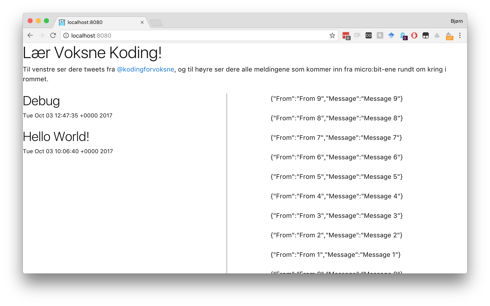

# micro-tweet
Tweeting from micro:bits. Sample project for [Teknas Kodekurs for
Voksne](http://tekna.no/kurs/kodekurs-for-voksne-34755/) course night #4
"Micro:bit programming and introduction to internet of things". The goal for
each participant is to program a micro:bit to send "Tweets" to our micro:bit
which hooked up to the internet. We'll run an interactive visualization of all
the radio messages as well as the tweets they're producing. Tweets are posted at
[@kodingforvoksne](http://twitter.com/kodingforvoksne). 

. 

